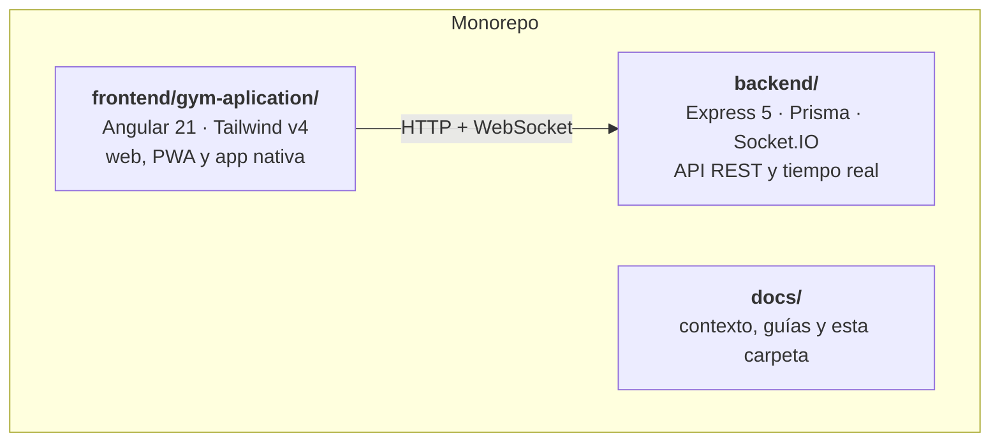
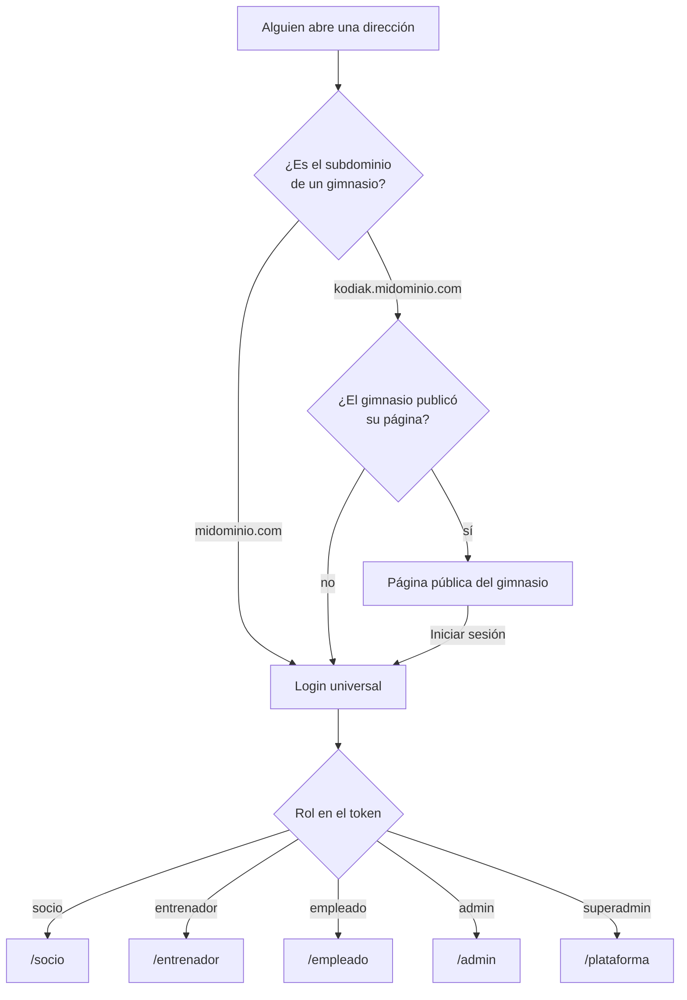

# Visión general

## Qué es

Un sistema de gestión para gimnasios, vendido como servicio: **un solo servidor
atiende a muchos gimnasios a la vez**, cada uno con sus socios, sus rutinas, sus
cobros y su página pública, sin verse entre ellos.

Cubre el día a día completo de un gimnasio: dar de alta socios, cobrarles la
mensualidad, registrar quién entra, armar rutinas, agendar sesiones uno a uno,
publicar novedades y seguir el progreso de cada persona.

## Quién lo usa

| Rol | Entra por | Qué alcanza |
| --- | --- | --- |
| **socio** | `/socio` | Solo lo suyo: su rutina, su progreso, sus medidas, sus pagos, su código de acceso |
| **entrenador** | `/entrenador` | Los socios que tiene asignados y su propia agenda |
| **empleado** | `/empleado` | Lo que su cargo permita; el caso típico es recepción |
| **admin** | `/admin` | Todo lo de **su** gimnasio |
| **superadmin** | `/plataforma` | El negocio: crea gimnasios, cobra la plataforma, no entra a los datos de nadie |

Un mismo correo puede tener cuenta en varios gimnasios: la identidad es
`(email, gymId)`, no el correo solo.

## Las piezas

Frontend y backend viven en el **mismo repositorio** a propósito: un cambio de
API y su consumidor entran en un mismo commit y nunca quedan desfasados. No hay
`package.json` en la raíz — cada proyecto instala y ejecuta lo suyo.

## Por dónde entra cada quien

**No hay pantalla para elegir gimnasio antes de entrar.** El login busca el
correo en todos los gimnasios; si la contraseña coincide en uno solo, entra
directo, y si coincide en varios, recién ahí pregunta cuál.

## Cómo se registra un socio

**Solo por invitación.** No existe registro público: el gimnasio genera un
enlace o QR de un solo uso y esa invitación es la que decide a qué gimnasio
entra la persona. El cliente nunca envía un `gymId`, así que es imposible
colarse en otro gimnasio o quedar sin ninguno.

## Módulos que se encienden y apagan

Cada gimnasio elige qué usa: rutinas, progreso, medidas, pagos, noticias y
cronómetro. Lo que apaga desaparece del menú de sus socios. Antes de dar por
sentado que una sección está visible, hay que mirar esa configuración.
