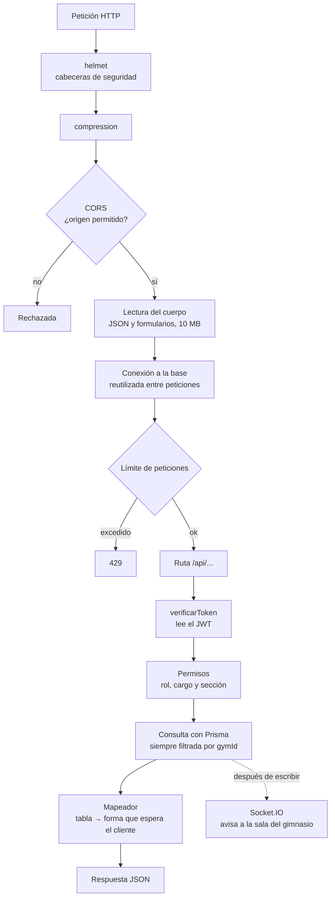

# El backend

Express 5 sobre Node, con Prisma como acceso a PostgreSQL y Socket.IO para los
avisos en vivo. Sin TypeScript y sin paso de compilación: es CommonJS y se
ejecuta tal como está escrito.

## El camino de una petición

El orden importa: cada capa asume que las anteriores ya hicieron su trabajo.



**Los límites de peticiones no son uniformes**: 30 cada 15 minutos en las
puertas de entrada (login, registro, recuperar contraseña, verificación en dos
pasos, validación de dispositivos) y 300 en el resto de la API. La diferencia
existe porque esas rutas son las únicas donde probar miles de combinaciones
sirve de algo.

**CORS es una lista blanca, no un comodín.** Acepta la URL del frontend
configurada, cualquier subdominio de `localhost` (para probar multi-gimnasio en
desarrollo), los orígenes de la app nativa y los subdominios del dominio raíz.

## Cómo está organizado

```
backend/
├── index.js          punto de entrada; exporta la app y escucha solo fuera de producción
├── server.js         punto de entrada del contenedor; siempre escucha
├── routes/           22 archivos, uno por área del negocio
├── middleware/       auth.js: quién sos y qué te dejo hacer
├── lib/              lógica pura y reutilizable, sin Express adentro
├── helpers/          lo que habla con el mundo: correo, WhatsApp, archivos, sockets
├── prisma/           esquema, migraciones, cliente y sus extensiones
└── tests/            Vitest, sin base de datos real
```

**Hay dos puntos de entrada y no se deben unificar.** `index.js` exporta la
aplicación y solo abre un puerto fuera de producción; `server.js` existe para el
contenedor, que corre con `NODE_ENV=production` y sí tiene que escuchar.

**`lib/` no conoce Express.** Ahí vive lo que se puede probar llamándolo
directamente: paginación, permisos, búsqueda, mapeadores, fechas de facturación.
`helpers/` es lo contrario: todo lo que sale hacia afuera.

## Las rutas

| Ruta | Para qué |
| --- | --- |
| `/api/auth` | Entrar, salir, registrarse por invitación, perfil, renovar sesión |
| `/api/invitaciones` | Crear y validar los enlaces de un solo uso |
| `/api/gym` | Datos del gimnasio, su página pública y los subdominios |
| `/api/rutinas` | Rutinas y sus ejercicios |
| `/api/asistencia` | Registro de entrada por código, QR o a mano |
| `/api/transacciones` | Cobros de mensualidad e historial |
| `/api/planes`, `/api/pagos` | Planes del gimnasio y métodos de cobro |
| `/api/citas` | Sesiones uno a uno: disponibilidad, reserva y cancelación |
| `/api/progreso`, `/api/medidas` | Seguimiento del socio |
| `/api/noticias`, `/api/feedback` | Comunicación con los socios |
| `/api/entrenador` | Lo que ve un entrenador de sus socios |
| `/api/admin` | Exportar e importar datos, auditoría |
| `/api/dispositivos` | Lectores de huella y torniquetes |
| `/api/archivos` | Subida de imágenes al almacén |
| `/api/2fa` | Verificación en dos pasos |
| `/api/buscador`, `/api/notificaciones` | Búsqueda global y avisos |
| `/api/planes-plataforma`, `/api/pagos-plataforma` | Lo que el superadmin le cobra a cada gimnasio |

## Decisiones que conviene entender

### El cliente de Prisma se construye una sola vez

Se pide siempre a `prisma/client.js`, nunca con `new PrismaClient()` en una
ruta. Ese cliente lleva dos extensiones y una configuración de campos ocultos
que se pierden si alguien crea el suyo.

### Las contraseñas no se leen por accidente

La contraseña y los secretos de la verificación en dos pasos están **ocultos por
omisión**: no aparecen aunque se pidan todas las columnas. Para leerlos hay que
pedirlos explícitamente en esa consulta puntual. Así, olvidarse de excluirlos no
termina en una contraseña viajando dentro de un JSON.

### La auditoría nunca rompe la operación

Registrar quién hizo qué está pensado para no fallar hacia afuera: si el
registro no se puede escribir, la operación que lo provocó sigue su curso. Un
problema al anotar algo no puede tumbar un cobro.

### Los avisos en vivo dicen "mirá de nuevo", no el dato

Cuando algo depende de un cálculo al momento de leer —días que le quedan a una
membresía, cuántos avisos hay sin leer— el evento no manda el valor: manda un
"algo cambió, volvé a preguntar". Un número calculado y enviado envejece mal.

Los eventos concretos son `asistencia:nueva`, `rutina:actualizada`,
`cita:nueva`, `cita:cancelada` y `avisos:revisar`.

### Los avisos se emiten después de escribir, nunca dentro de una transacción

Son de mejor esfuerzo: no se esperan ni se reintentan. Emitir desde dentro de
una transacción avisaría de algo que todavía podría deshacerse.

### Sin sockets no se cae nada

El canal en tiempo real se monta sobre el servidor HTTP, no sobre Express.
Donde no hay un proceso vivo que sostenga la conexión, simplemente no hay
avisos: la aplicación funciona igual, solo que hay que recargar para ver los
cambios.

## Pruebas

Vitest, y **sin base de datos**. Las pruebas llaman a funciones puras o a rutas
con peticiones y respuestas simuladas. Las variables de entorno se preparan
antes de cargar los módulos, porque varios las leen al importarse, y la cadena
de conexión de prueba apunta a ninguna parte a propósito: construir el cliente
no conecta, así que mientras nadie consulte de verdad, todo funciona.
