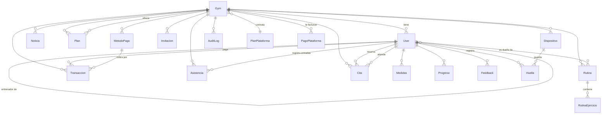

# El modelo de datos

PostgreSQL con Prisma. 17 tablas, casi todas colgando del gimnasio.

## Cómo se relacionan

## Las tablas, en grupos

**El gimnasio y su gente**
- `Gym` — nombre, slug, colores, módulos activos, configuración de agenda y la
  página pública completa.
- `User` — todos los roles en una sola tabla; el campo `role` los distingue.
- `Invitacion` — enlace de un solo uso para registrarse.

**Entrenamiento**
- `Rutina` y `RutinaEjercicio` — la rutina y sus ejercicios, en orden.
- `Progreso`, `Medidas` — seguimiento del socio.

**Dinero**
- `Plan` — lo que el gimnasio le vende a sus socios.
- `MetodoPago`, `Transaccion` — cómo cobra y qué cobró.
- `PlanPlataforma`, `PagoPlataforma` — lo que la plataforma le cobra al gimnasio.

**Operación diaria**
- `Asistencia` — cada entrada al gimnasio.
- `Cita` — sesiones uno a uno.
- `Dispositivo`, `Huella` — lectores de huella y torniquetes.
- `Noticia`, `Feedback` — comunicación.
- `AuditLog` — quién hizo qué y cuándo.

## Convenciones que hay que respetar

### Las claves primarias son cadenas de 24 hexadecimales

No son UUID ni enteros: son el formato de identificador de MongoDB, guardadas
como `CHAR(24)`. Fue **deliberado** al migrar desde Mongo: permitió copiar los
datos tal cual, sin recalcular una sola referencia, y que las sesiones abiertas
siguieran funcionando durante el cambio.

Las filas nuevas generan ese mismo formato mediante una extensión de Prisma.
**Esa extensión solo alcanza a las operaciones de primer nivel**: al crear
registros anidados dentro de una relación hay que generar el identificador a
mano. Olvidarlo falla ruidosamente, no en silencio.

### Borrado suave en siete tablas

`Gym`, `User`, `Rutina`, `Noticia`, `Plan`, `MetodoPago` y `Transaccion` no se
borran: se marcan. Una extensión agrega el filtro automáticamente a toda
lectura y actualización.

**Es el comportamiento más sorprendente del backend**: una fila que "no existe"
casi siempre está marcada como borrada. Para verlas hay que pedirlo
explícitamente en esa consulta.

Dos tablas quedaron fuera a propósito: una cita cancelada es un estado final y
legítimo, no un borrado; y una invitación es material de un solo uso con su
propio ciclo de vida.

> **Pendiente conocido**: las invitaciones usadas o vencidas se acumulan. Mongo
> las eliminaba solo; en PostgreSQL nadie las limpia todavía.

### El correo es único por gimnasio, no en todo el sistema

La misma persona puede tener cuenta en varios gimnasios. Los superadmin no
pertenecen a ninguno, y como PostgreSQL considera distintos dos valores vacíos,
hizo falta un índice parcial escrito a mano para que dos superadmin no puedan
compartir correo. Prisma no sabe expresar esos índices, así que vive dentro de
la migración inicial.

### Formas anidadas que la base no tiene

El cliente espera objetos anidados —los datos personales del socio, las
estadísticas, los colores del gimnasio, sus módulos, su agenda— pero en la base
son **columnas planas**. Entre una cosa y otra hay mapeadores que arman y
desarman esas formas en el borde de la API.

Lo mismo pasa con los identificadores: las filas traen `id` y la API responde
`_id`. El mapeador cambia uno por otro, nunca deja los dos.

**Si agregás un campo a alguno de esos grupos, tenés que tocar el modelo y su
mapeador.** Si no, el campo desaparece silenciosamente entre la base y el JSON.

La página pública es la excepción: se guarda como un único documento JSON,
porque se edita entera de una vez y nadie necesita consultar sus partes por
separado.

### Fechas y horas de las citas: texto, no marcas de tiempo

Una cita guarda su día y su hora como texto plano. Suena mal hasta que se ve el
motivo: **el servidor corre en un huso y el gimnasio está en otro**. Una marca
de tiempo se correría de hora al leerla. Las 7 de la mañana son las 7 de la
mañana en la puerta del gimnasio, y punto.

### El dinero no es un número decimal común

Precios e importes usan el tipo decimal exacto de la base. Compararlos o
sumarlos como números normales introduce errores de redondeo — hay que tratarlos
con el tipo que corresponde.

### Dos reglas que impone la base, no el código

- **No se puede reservar dos veces el mismo turno**: un índice parcial lo
  impide. La verificación en el código ayuda, pero la que manda es la base;
  cuando salta, se traduce a un conflicto legible para el cliente.
- **Una invitación no se puede usar dos veces**: consumirla es una única
  operación condicional, no leer y después escribir. Dos registros simultáneos
  con el mismo enlace no pueden ganar los dos. Y si algo falla después de
  consumirla, se libera para que el enlace no quede quemado por un error pasajero.
