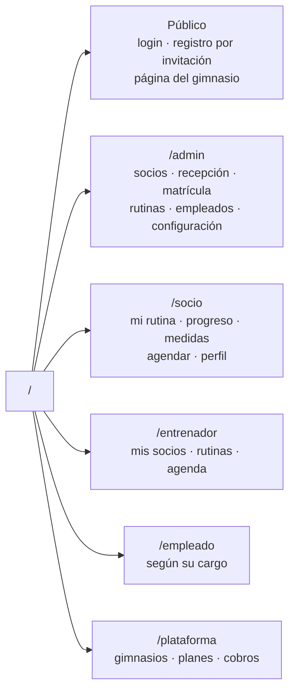

# El frontend

Angular 21 con componentes independientes (sin módulos), Tailwind v4 para los
estilos y Capacitor para empaquetarlo como aplicación de Android y iOS. El mismo
código sirve tres cosas: la web, una aplicación instalable y la app nativa.

## Cómo está organizado

```
src/app/
├── app.config.ts      arranque: resolución del gimnasio por subdominio, tema, errores
├── app.routes.ts      un árbol de rutas por rol, todo cargado bajo demanda
├── components/        una carpeta por zona: admin, socio, entrenador, empleado,
│                      superadmin, auth, landing y shared
├── services/          una fachada por área; nadie llama a la API directamente
├── guards/            quién puede ver qué
└── interceptors/      el token y el manejo de errores de red
```

## Las zonas y sus rutas



**Todas las pantallas se cargan bajo demanda**, y las que comparten varios roles
—noticias, planes, pagos— se declaran una sola vez y se insertan en los dos
árboles. Mientras el usuario mira una pantalla, el resto se va descargando de
fondo.

## Servicios

Cada área tiene el suyo y **ningún componente arma una dirección de API a mano**:
todas salen de la configuración del entorno. Cambiar de servidor es cambiar un
archivo, no buscar direcciones sueltas por el código.

Los que sostienen la aplicación entera:

| Servicio | Qué resuelve |
| --- | --- |
| `auth` | Entrar, salir, perfil |
| `user-state` | Quién es el usuario en esta sesión |
| `gym` | El gimnasio activo, guardado localmente |
| `theme` | Modo claro/oscuro y los colores de la marca |
| `storage` | Acceso al almacenamiento del navegador |
| `token-monitor` | Vigila el vencimiento de la sesión |
| `tiempo-real` | Recibe los avisos del servidor |
| `tenant` | Resuelve el gimnasio a partir del subdominio |
| `i18n` | Textos en español e inglés |

### Nunca se borra todo el almacenamiento local

Hay un servicio dedicado para cerrar sesión que **conserva** el cronómetro en
curso, el tema elegido y el gimnasio activo. Borrar todo de una vez apaga el
cronómetro de alguien que está entrenando y devuelve la aplicación a los colores
de fábrica. El cronómetro además se guarda en una base local del navegador, para
sobrevivir incluso a un borrado completo.

### La sesión se vigila sola

Un servicio revisa el token cada minuto: lo renueva cuando quedan menos de dos
horas, avisa por debajo de media hora y cierra la sesión al vencer. La persona
no se entera salvo que se le acabe el tiempo.

## El interceptor de peticiones

Tres decisiones que vale la pena conocer:

1. **Adjunta el token y nada más.** No manda ninguna cabecera con el
   identificador del usuario: quién es se deduce del token verificado en el
   servidor, no de algo que el cliente pueda escribir.
2. **Un 401 cierra la sesión… salvo en las pantallas de entrada.** En login o
   registro, un 401 significa "contraseña incorrecta", no "se te venció la
   sesión". Sin esa excepción, equivocarse al escribir la contraseña te expulsa.
3. **Solo reintenta lecturas.** Reintentar un cobro porque la red tardó podría
   cobrarlo dos veces.

## Colores y temas

Dos sistemas que no se mezclan:

- **Los colores del gimnasio** pintan los botones de acción y los acentos. Son
  dos, y de ellos se calcula el color de la letra que va encima según su
  contraste, para que un gimnasio con color claro no termine con botones
  ilegibles.
- **Claro y oscuro** los decide el dispositivo, y gobiernan las superficies:
  fondos, barra, menú, tarjetas y textos. Esos **no dependen del color del
  gimnasio**, justamente para que el contraste esté garantizado pase lo que pase.

Todo se resuelve con variables CSS que el servicio de tema escribe en la raíz
del documento, así que el modo se aplica sin JavaScript de por medio.

## Un gimnasio por subdominio

Al arrancar, si la dirección es el subdominio de un gimnasio, la aplicación lo
resuelve y aplica sus colores **antes** de mostrar la primera pantalla. Sin
subdominio no hay gimnasio fijo y se usa el flujo normal. En desarrollo funciona
igual con direcciones locales.

## Aplicación instalable y app nativa

- **Instalable (PWA)**: solo en las compilaciones de producción para navegador.
- **Nativa**: se empaqueta con Capacitor tomando lo ya compilado. Por eso hay que
  **compilar antes de sincronizar**: si no, se empaqueta la versión anterior sin
  ningún aviso.
- Dentro de la app nativa el trabajador de servicio **estorba** y se desactiva a
  propósito: su caché sobrevive a reinstalar la aplicación.

## Pruebas

- **Unitarias**: junto a cada archivo, con las peticiones simuladas.
- **De punta a punta**: Playwright con selectores por lo que ve el usuario, no
  por clases CSS. El servidor de desarrollo no se levanta solo: hay que tenerlo
  corriendo.
