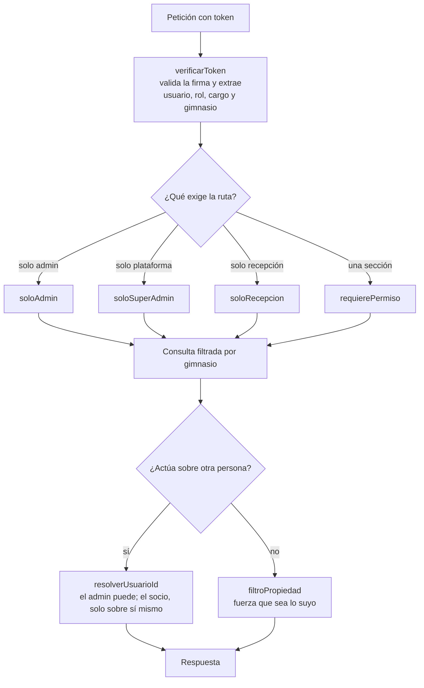
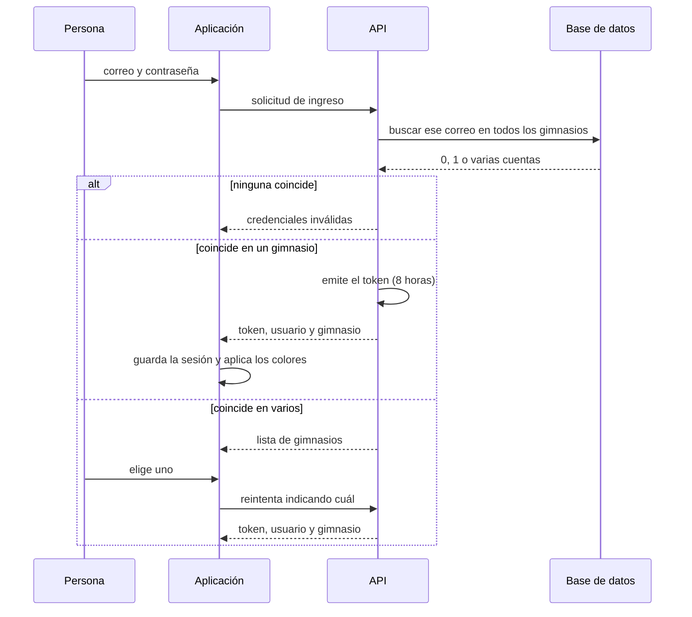

# Seguridad y aislamiento entre gimnasios

## La regla que sostiene todo

**Cada fila lleva el gimnasio al que pertenece, y toda consulta filtra por él.**

El token dice a qué gimnasio pertenece quien pregunta, el middleware lo deja
disponible en la petición, y cada consulta lo usa. No hay una segunda barrera:
si una consulta se olvida de ese filtro, los datos de un gimnasio quedan
expuestos a otro.

Por eso el valor **nunca se toma de lo que manda el cliente**: sale del token,
que está firmado y no se puede alterar.

## Las capas

**Las comprobaciones del navegador son comodidad, no seguridad.** Que la pantalla
esconda un botón no impide que alguien llame a la API por su cuenta. La barrera
real está siempre en el servidor; las dos capas tienen que existir, y la del
cliente no cuenta como protección.

## Dos ayudas contra un error clásico

El error más fácil de cometer es confiar en un identificador que llega en la
petición: pedir "el perfil del usuario 123" y devolverlo sin comprobar quién
pregunta. Hay dos funciones para no caer:

- **Resolver a quién se afecta**: un administrador puede actuar sobre otra
  persona; un socio o un entrenador quedan forzados a sí mismos, aunque envíen
  otro identificador.
- **Forzar propiedad**: agrega la condición de que la fila sea suya cuando quien
  pregunta no es administrador.

## Permisos por sección

Además del rol hay permisos finos sobre siete secciones: noticias, socios,
rutinas, planes, pagos, empleados y recepción. Tres niveles, cada uno incluye al
anterior:

| Nivel | Qué puede |
| --- | --- |
| `ninguno` | La sección ni aparece en el menú |
| `lectura` | La ve, no la toca |
| `edicion` | Ve, crea y modifica |

**Borrar quedó fuera a propósito** y es exclusivo del administrador: es lo único
que no se deshace. Si algún día hace falta repartirlo, va como un cuarto nivel,
no como una excepción suelta.

Cada cuenta arranca con los permisos de fábrica de su rol —o de su cargo, en el
caso de los empleados— y el administrador puede ajustarlos. Los cargos sin
pantallas propias empiezan sin nada: entran, pero el administrador decide.

## Cómo se entra

Con Google es igual, con una diferencia importante: **nunca crea una cuenta**. Si
el correo no existe, responde que hace falta una invitación. Si creara cuentas,
cualquiera con una cuenta de Google entraría a un gimnasio que no lo invitó.

## Otras defensas

- **Verificación en dos pasos** opcional, con códigos temporales y códigos de
  respaldo que se muestran **una sola vez**: el servidor guarda su huella, no los
  códigos, y no puede volver a enseñarlos.
- **Contraseñas ocultas por omisión** al consultar la base.
- **Auditoría** de las operaciones sensibles.
- **Límite de intentos** en las puertas de entrada.
- **Aislamiento en los avisos en vivo**: la conexión se autentica al abrirse y
  cada una entra a la sala de su gimnasio y a la suya propia. Un aviso no puede
  cruzar de un gimnasio a otro.
- **Certificados solo para dominios conocidos**: antes de emitir uno para un
  subdominio nuevo, el servidor pregunta si ese gimnasio existe. Sin esa
  comprobación, alguien apuntando su dominio al servidor podría hacer que pida
  certificados sin parar hasta que la autoridad lo bloquee.

## Lo que queda abierto

Ver [AUDITORIA-PENDIENTES.md](../AUDITORIA-PENDIENTES.md) para lo que la
auditoría de seguridad corrigió y lo que sigue pendiente.
