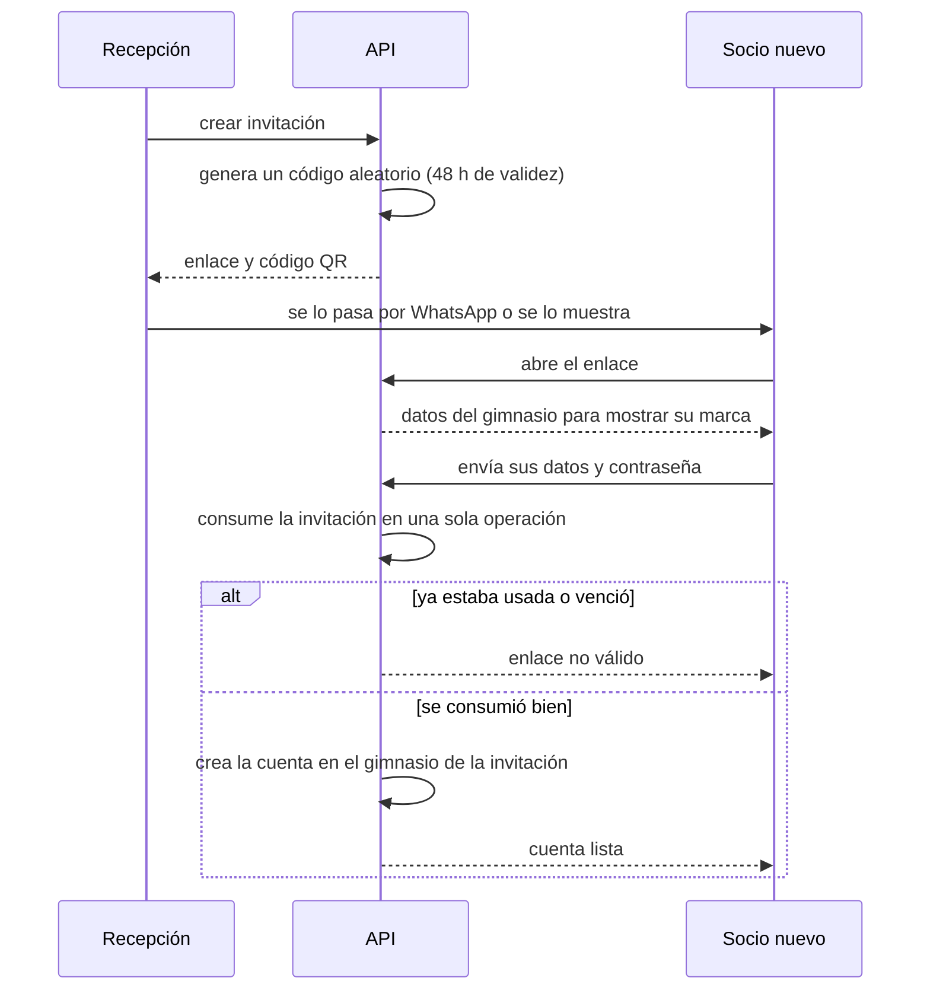
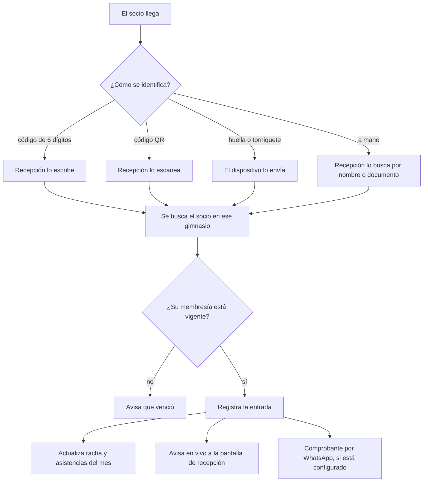
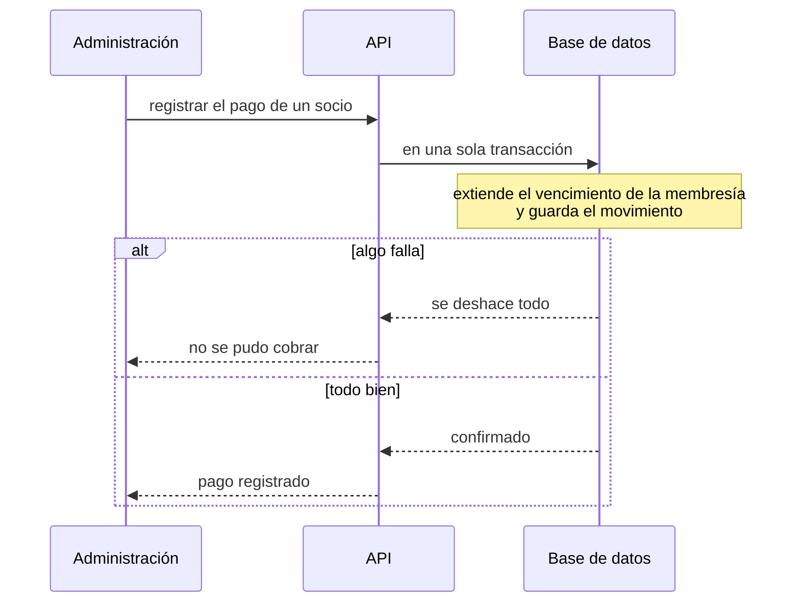
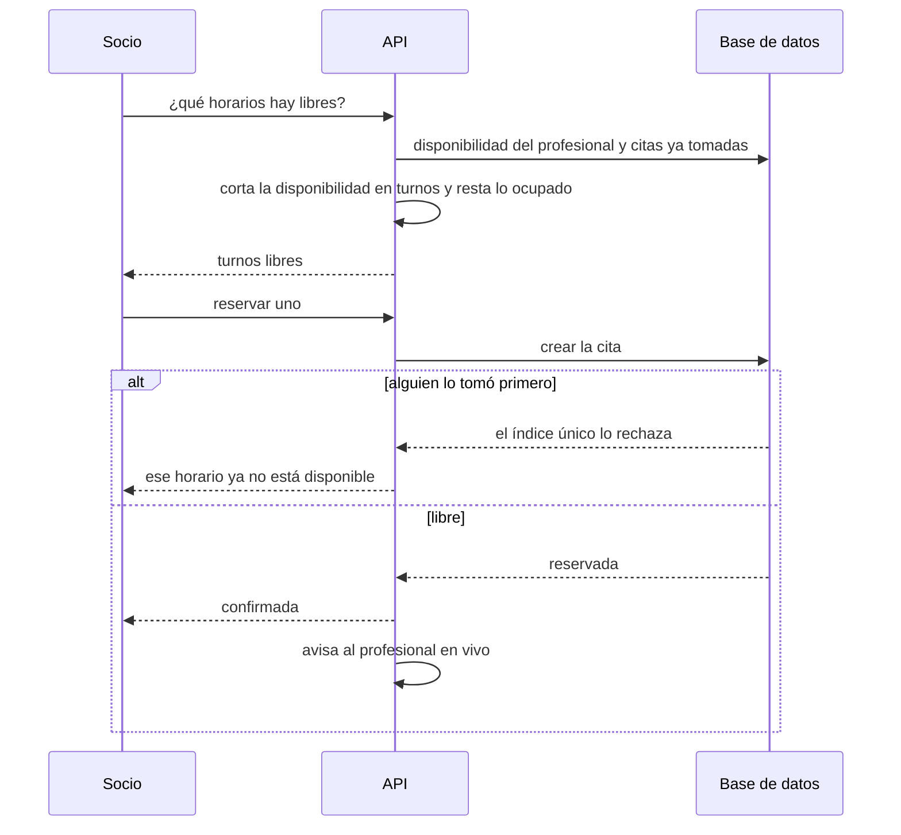
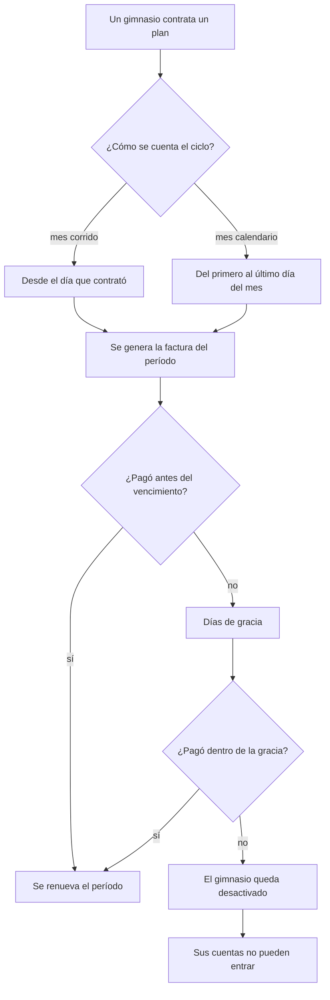

# Los flujos importantes

Cinco recorridos que explican cómo trabaja el sistema en la práctica.

## 1. Dar de alta un socio

No existe registro público: siempre empieza en el gimnasio.

**El cliente nunca dice a qué gimnasio entra**: lo decide la invitación. Así es
imposible colarse en otro o quedar sin ninguno.

La invitación se consume con **una única operación condicional**, no leyendo y
después escribiendo. Dos personas abriendo el mismo enlace a la vez no pueden
registrarse las dos. Y si algo falla después de consumirla, se libera: un error
pasajero no quema el enlace.

## 2. Registrar una entrada al gimnasio

## 3. Cobrar una mensualidad

**Las dos escrituras van juntas o no va ninguna.** Antes eran dos operaciones
sueltas: si la segunda fallaba, quedaba un socio con la membresía extendida y sin
registro del cobro, o un cobro registrado que no le sirvió de nada. Fue una
corrección real durante la migración, no una formalidad.

## 4. Reservar una sesión uno a uno

**Nada se precalcula.** Los turnos se arman al momento de preguntar, así que un
cambio de horario del entrenador se refleja en la consulta siguiente sin tener
que regenerar nada.

**La última palabra la tiene la base**, no la comprobación previa: entre mirar si
está libre y guardar la reserva pasa un instante, y en ese instante otro puede
tomarlo. El índice único lo impide de verdad, y el rechazo se traduce en un
mensaje claro.

## 5. Cobrar la plataforma a cada gimnasio

Este es el negocio del superadmin: los gimnasios son sus clientes.

Dos detalles que conviene tener presentes:

- **La desactivación se aplica al intentar entrar**, no en un proceso nocturno.
  Antes de decidir si alguien puede pasar, el sistema pone al día los
  vencimientos. Sin eso, desactivar automáticamente no tendría ningún efecto
  real: la gente seguiría entrando.
- **Las fechas se calculan en el huso del gimnasio**, no en el del servidor. Un
  vencimiento que cae a medianoche cambia de día según dónde se lo mire.
