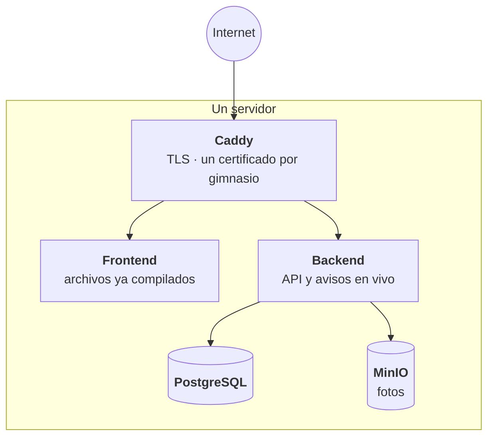

# Despliegue

## A dónde va esto

El destino es **un servidor propio** con toda la pila en contenedores. Se puede
desplegar de otras formas, pero esa es la dirección.

**Caddy pide los certificados solo**, incluso para subdominios que nunca vio.
Antes de pedir uno, le pregunta al backend si ese gimnasio existe: sin esa
comprobación, alguien apuntando su dominio al servidor podría hacer que pida
certificados hasta que la autoridad bloquee el servidor entero.

## Tres archivos de contenedores, que no son lo mismo

| Archivo | Para qué | Cómo se configura |
| --- | --- | --- |
| `docker-compose.local.yml` | Desarrollo: compila todo desde el código e incluye base de datos, almacén de fotos y un buzón de correo de prueba | Un archivo de variables en la raíz |
| `backend/docker-compose.yml` | Despliegue simple: descarga las imágenes ya compiladas, sin base de datos incluida | Variables del backend |
| `docker-compose.prod.yml` | El servidor de verdad: todo lo anterior más Caddy | `.env.prod` |

Confundirlos es fácil y las consecuencias son molestas: levantar el de desarrollo
en un servidor deja una base de datos vacía junto a la buena.

## Correo

En desarrollo, un buzón local **captura todos los mensajes** en vez de
entregarlos: se pueden leer en el navegador y nadie recibe correos de prueba por
error. El transporte se elige según la configuración, y hay una única función que
responde "¿se puede enviar?" — conviene usarla en vez de mirar las variables una
por una, o el entorno de desarrollo se rompe.

## Integración continua

Cuatro procesos automáticos, cada uno atento **solo a su área**, para que un
cambio en el servidor no dispare la compilación de la aplicación móvil:

| Proceso | Qué produce |
| --- | --- |
| `backend-docker` | Imagen del servidor |
| `frontend-docker` | Imagen del frontend |
| `android-build` | Un instalable de Android para probar |
| `ios-build` | Compilación de iOS sin firmar |

## La aplicación móvil

Se empaqueta con Capacitor a partir de lo ya compilado para web. De ahí sale la
regla más importante: **hay que compilar antes de sincronizar**. Si no, se
empaqueta la versión anterior y no avisa nada.

## Restos del diseño anterior

Este proyecto nació pensado para una plataforma sin servidor fijo, y quedan
huellas:

- Un mecanismo para **reutilizar la conexión a la base entre peticiones**, con un
  candado para que varias en paralelo no abran conexiones de más durante un
  arranque en frío. Con un servidor permanente ya no hace falta —el propio
  cliente de base de datos maneja eso— pero no se limpió todavía.
- **Dos puntos de entrada** al servidor, uno que solo escucha fuera de producción
  y otro para el contenedor. No se deben unificar.

## Una trampa de estilos que ya costó cara

Los estilos usan capas en cascada, y **hay que respetarlas en todas las formas de
compilar**. Hubo un paso que las aplanaba para simular ese orden inflando la
especificidad de los selectores; el resultado fue que los estilos base ganaban a
los de cada componente y **todos los botones y campos de la aplicación perdían su
color y su forma**.

Lo peor fue el diagnóstico: ese paso reescribía el archivo **después** de que se
le pusiera nombre, así que el mismo nombre de archivo contenía cosas distintas
en cada entorno. Comparar nombres no servía de nada; había que comparar tamaños o
buscar las capas dentro del archivo.

## Guías paso a paso

- [DESPLIEGUE-VPS.md](../DESPLIEGUE-VPS.md) — el servidor propio, de cero
- [DESPLIEGUE-Y-MOVIL.md](../DESPLIEGUE-Y-MOVIL.md) — publicación y aplicaciones
- [SUBDOMINIOS.md](../SUBDOMINIOS.md) — activar un subdominio por gimnasio
