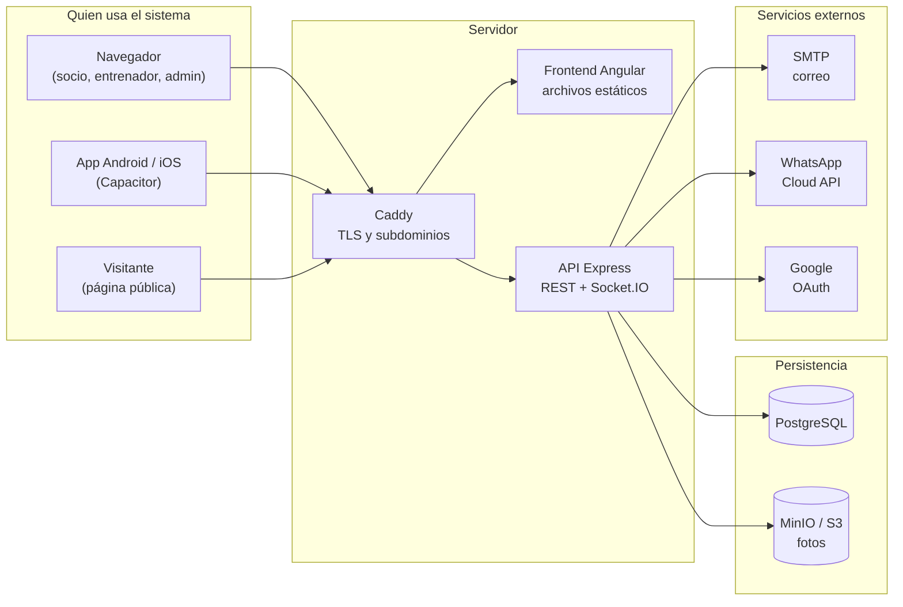

# Arquitectura

Cómo está construido este proyecto y por qué. Escrito para alguien que llega
nuevo y necesita entender el sistema antes de tocarlo.

| Documento | De qué trata |
| --- | --- |
| [01-vision-general.md](01-vision-general.md) | Qué es el producto, quiénes lo usan y qué piezas lo forman |
| [02-backend.md](02-backend.md) | El servidor: pipeline de una petición, capas y decisiones de diseño |
| [03-modelo-datos.md](03-modelo-datos.md) | Las tablas, cómo se relacionan y las convenciones que las rigen |
| [04-frontend.md](04-frontend.md) | La aplicación Angular: rutas por rol, servicios y temas |
| [05-seguridad.md](05-seguridad.md) | Autenticación, roles, permisos y el aislamiento entre gimnasios |
| [06-flujos.md](06-flujos.md) | Los recorridos importantes, paso a paso |
| [07-despliegue.md](07-despliegue.md) | Entornos, contenedores, CI y la app móvil |

Los diagramas están en [Mermaid](https://mermaid.js.org/) dentro de los propios
documentos: se ven renderizados en GitHub y en VS Code, y se editan como texto,
así que no hay imágenes que queden desactualizadas respecto del código.

## El sistema en una imagen

## Lo que hay que saber sí o sí

Cinco cosas que explican la mayoría de las decisiones del código:

1. **Un servidor, muchos gimnasios.** Cada fila de datos lleva `gymId` y toda
   consulta filtra por él. Es la única barrera entre los datos de un gimnasio y
   los de otro — ver [05-seguridad.md](05-seguridad.md).
2. **Las claves primarias son cadenas de 24 caracteres hexadecimales**, no UUID
   ni enteros. Es herencia de MongoDB y fue una decisión deliberada al migrar —
   ver [03-modelo-datos.md](03-modelo-datos.md).
3. **Hay borrado suave.** Una fila "que no existe" suele estar marcada como
   borrada, no eliminada. Es el comportamiento más sorprendente del backend.
4. **El frontend espera formas anidadas que la base no tiene.** Entre la tabla y
   el JSON hay mapeadores que arman y desarman esas formas.
5. **El destino es un servidor propio**, no una plataforma serverless. Quedan
   restos del diseño anterior que todavía no se limpiaron — ver
   [07-despliegue.md](07-despliegue.md).
